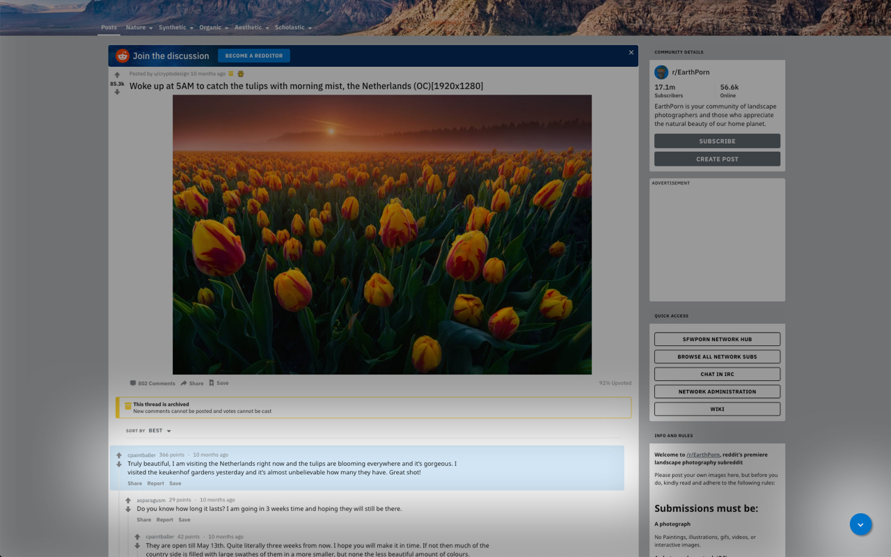

# Reddit Scrollit

<h3 align="center"> 
Adds the button from Reddit mobile to jump to the next top-level comment.
</h3> 

## Overview

[**Get it on the Chrome Web Store**](https://chrome.google.com/webstore/detail/reddit-scrollit/bbbjmjmeeakpmelfiommppfnagkgpoed)

Reddit Scrollit is a [Chrome extension](https://chrome.google.com/webstore/detail/reddit-scrollit/bbbjmjmeeakpmelfiommppfnagkgpoed) that adds a small button in the bottom right corner of the page (similar to Reddit's mobile app) to quickly jump to the next top-level comment.

Comment hierarchies can become quite dense and difficult to navigate, hopefully this makes it a bit easier :) 

